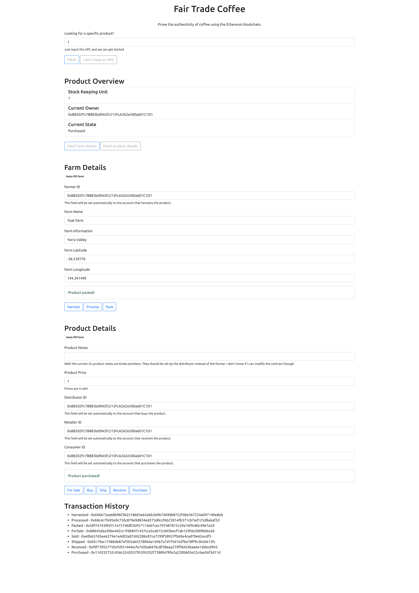

# Supply chain project

Hey there reviewer. This is my submission for the supply chain project.

## Contract address
https://rinkeby.etherscan.io/address/0xCca8647C85eE4f337F1830972D0BC93446Cd5FA9

## Libraries used
For the smart contracts:
* `truffle-test-utils`: used this library to simplify testing event emissions

For the frontend:
* `webpack`: I preferred using webpack since it's more powerful that lite-server

## IPFS
Unfortunately I don't have time to deploy the front end in IPFS. Neither can I deal with pic uploads :(. Might do it in the future for the learnings.

## Version numbers

* Program: `1.0.0`
* node: `v16.5.0`
* Truffle: `v5.4.6`
* web3: `^1.2.4`

## Documentation
[activity]: ./images/Activity.png
[sequence]: ./images/Sequence.png
[state]: ./images/State.png
[class]: ./images/Class.png

### Activity diagram

![Activity][activity]

### Sequence diagram

![Sequence][sequence]

### State diagram

![State][state]

### Class diagram

![Class][class]

## Working example
I've taken the librty of including an image of the working product. Hopefully it's useful for the evaluation.

